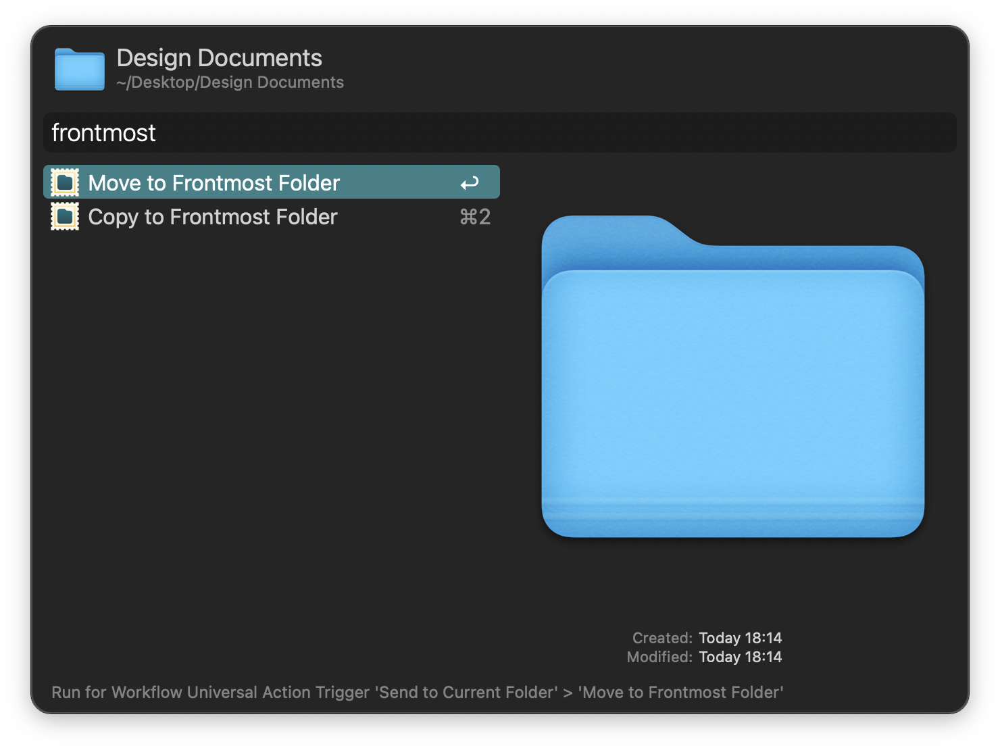

#  Send to Current Folder Alfred Workflow

Move or copy files to the frontmost Finder window

[⤓ Install on the Alfred Gallery](https://alfred.app/workflows/alfredapp/send-to-current-folder)

## Usage

Move or copy files to the frontmost Finder window via the [Universal Actions](https://www.alfredapp.com/help/features/universal-actions/).

* <kbd>↩&#xFE0E;</kbd> Perform the action.
* <kbd>⌘</kbd><kbd>↩&#xFE0E;</kbd> Perform the action and reopen the Universal Actions panel for the files in the new location.
